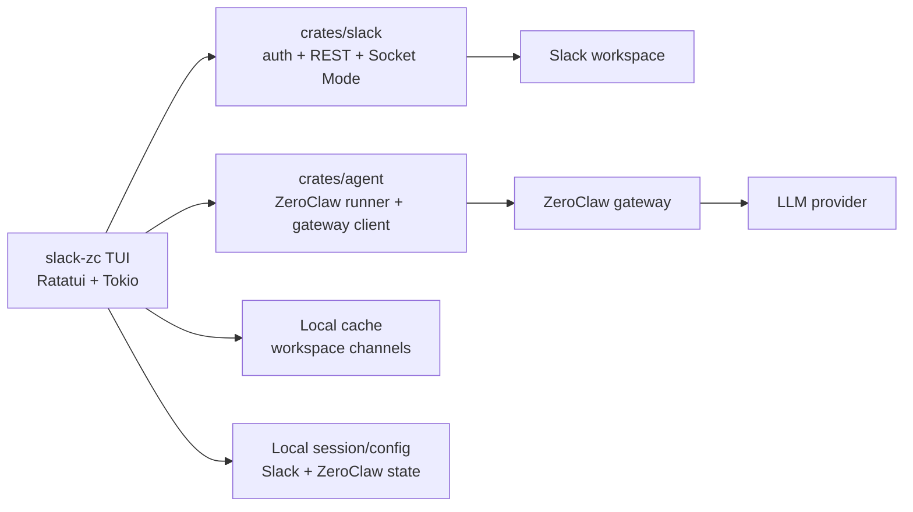
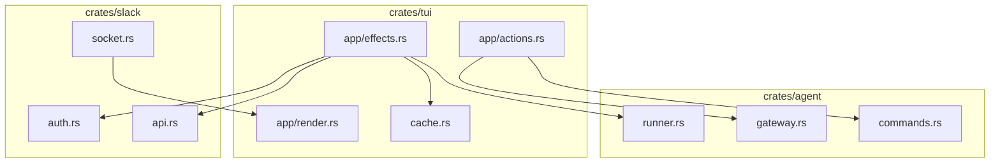
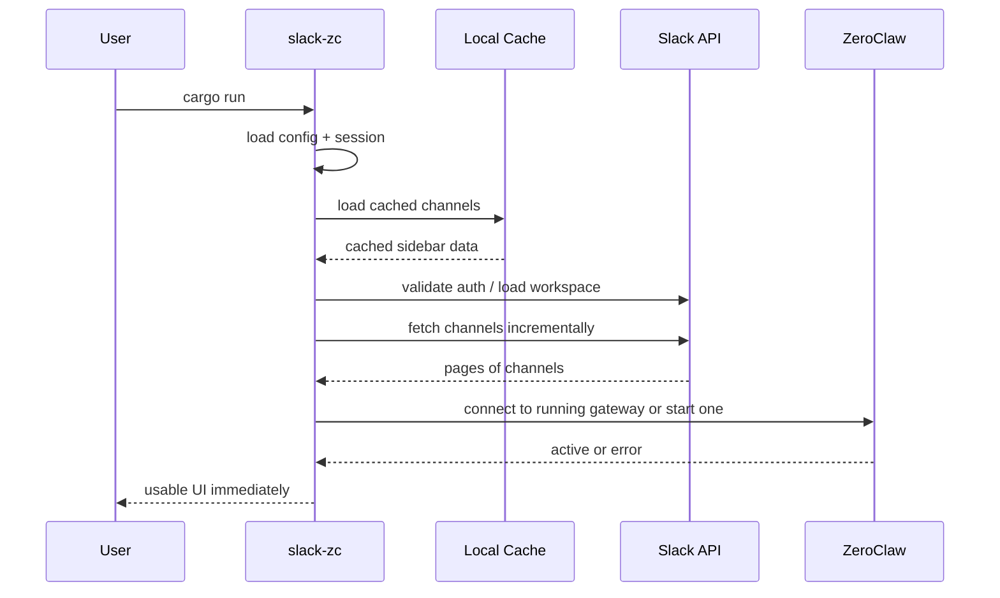
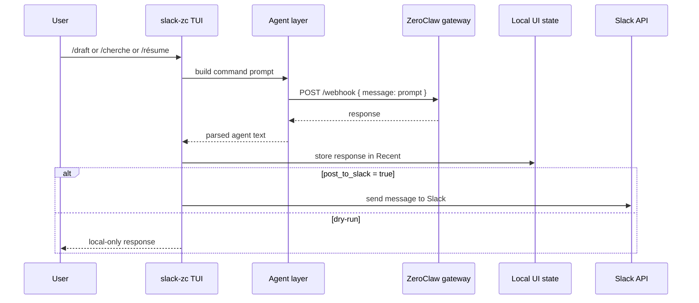

# slack-zc

A terminal Slack client written in Rust, with ZeroClaw integration for AI-assisted commands directly from the TUI.

## Quick Look

```
┌─────────────────────────┬──────────────────────┬──────────────┐
│ CHANNELS                │ MESSAGES             │ ZEROCLAW     │
│ #general       [1]      │ 14:23 alice          │ ZEROCLAW     │
│ #random        [0]      │   hello team!        │              │
│ #dev                    │ 14:25 you            │ Status: ✓    │
│ #design                 │   /draft can you...  │ Commands:    │
│ @bob          [2 unread]│ 14:26 claude         │ /résume      │
│ @alice                  │   Here's a summary   │ /draft       │
└─────────────────────────┴──────────────────────┴──────────────┘
[input: type your message here...]
```

## Current State

The project currently provides:

- Slack authentication and workspace loading
- Incremental channel loading for large workspaces
- Local channel cache for faster restarts
- ZeroClaw agent integration in the right-side panel
- Safe `dry-run` mode for agent commands

By default, agent responses are **not posted to Slack**. They stay local in the TUI until you explicitly enable posting.

## Features

- **Terminal-first Slack client** - navigate channels and message history from the TUI
- **Multi-workspace** - switch workspaces from the interface
- **AI commands** - `/résume`, `/draft`, `/cherche` via ZeroClaw
- **Incremental loading** - the UI stays usable while large Slack workspaces finish loading
- **Channel cache** - previously loaded channels are restored immediately on restart
- **Mouse support** - click panels and resize the layout
- **Search** - `Ctrl+K` to find channels and DMs quickly
- **Safe testing mode** - `dry-run` prevents accidental Slack spam while testing agent flows

## Architecture



### Internal Module Layout



**Data Flow:**
1. `slack-zc` authenticates against Slack and loads the current workspace
2. Channels are restored from local cache, then refreshed from Slack in the background
3. Slack history and live events are rendered in the TUI
4. `/résume`, `/draft`, `/cherche` are converted into prompts and sent to the local ZeroClaw gateway
5. ZeroClaw returns a response that is shown in the agent panel
6. If `post_to_slack = true`, the response may also be posted back to Slack

### Startup Flow



### Agent Command Flow



## Installation

### Prerequisites
- Rust 1.70+ ([install here](https://rustup.rs/))
- A Slack workspace and valid Slack app credentials or tokens
- ZeroClaw installed locally for AI features
- A configured ZeroClaw account/provider

### Build from Source

```bash
git clone https://github.com/ssime-git/slack-zc.git
cd slack-zc
cargo build --release
./target/release/slack-zc
```

The binary will be at `./target/release/slack-zc`.

## Configuration

### Environment Variables (Optional Quick Setup)

Create a `.env` file in the project root:

```bash
# Slack tokens from your app setup
SLACK_APP_TOKEN=xapp-1-...           # Socket Mode token (starts with xapp-)
SLACK_USER_TOKENS=xoxp-...           # User token (starts with xoxp-)

# Optional: history limits
SLACK_HISTORY_LIMIT=50               # Messages to load per channel
SLACK_HISTORY_MIN=10                 # Minimum
SLACK_HISTORY_MAX=200                # Maximum
```

If the tokens are already present in `.env`, `cargo run` is usually enough to start.

### Persistent Config

Config file location: `~/.config/slack-zc/config.toml`

Auto-created on first launch with defaults:

```toml
[slack]
client_id = ""              # OAuth app ID (get from Slack)
client_secret = ""          # OAuth app secret (get from Slack)
redirect_port = 3000        # Local port for OAuth callback

[zeroclaw]
binary_path = "zeroclaw"    # Where ZeroClaw binary is installed
gateway_port = 58080        # Fallback port if ZeroClaw config is unavailable
auto_start = true           # Auto-start ZeroClaw on app launch
timeout_seconds = 30        # Timeout for ZeroClaw requests
post_to_slack = false       # Safe by default: keep agent replies local in the TUI

[llm]
provider = "openrouter"     # or anthropic, openai, etc.
api_key = ""                # Your LLM API key
```

Notes:

- `slack-zc` tries to reuse your existing ZeroClaw local state from `~/.zeroclaw`
- if ZeroClaw has its own configured gateway port, `slack-zc` will prefer that over the fallback `gateway_port`
- `post_to_slack = false` means agent commands are executed, but their results are **not** posted to Slack

## Getting Started

### Step 1: Create a Slack App

1. Go to https://api.slack.com/apps and create a new app
2. In **Socket Mode** section, enable it and generate a token (note the `xapp-...` token)
3. In **OAuth & Permissions**, add these scopes:
   ```
   channels:read, channels:history, channels:join
   groups:read, groups:history
   im:read, im:history, mpim:read, mpim:history
   chat:write, reactions:write
   users:read, users:read.email
   files:read, team:read, connections:write
   ```
4. Install the app to your workspace
5. Keep your **Client ID** and **Client Secret** handy (from **App Credentials**)

### Step 2: Install ZeroClaw

ZeroClaw is required for `/résume`, `/draft`, and `/cherche`.

```bash
# Install via Homebrew
brew install zeroclaw

# Or build from source
git clone https://github.com/zeroclaw-labs/zeroclaw.git
cd zeroclaw
cargo install --path .
```

### Step 3: Configure ZeroClaw

```bash
# Interactive setup wizard (recommended)
zeroclaw onboard --interactive

# Or quick setup with OpenRouter
zeroclaw onboard --api-key "sk-or-..." --provider openrouter
```

This creates the ZeroClaw local state used by `slack-zc`, typically under `~/.zeroclaw/`.

### Step 4: Launch slack-zc

```bash
cargo run
```

What happens on startup:

1. Slack auth/session is loaded
2. cached channels are displayed immediately if available
3. the full workspace refresh continues in the background
4. ZeroClaw tries to connect to an existing local gateway or start one automatically

If ZeroClaw cannot connect, the TUI stays usable and the right panel shows the error.

## Usage

### Keyboard Shortcuts

**Navigation:**
- `Tab` - Move focus between panels (sidebar, messages, input)
- `Up/Down` or `Scroll` - Scroll through messages
- `Ctrl+W` - Switch workspaces

**Messaging:**
- `Enter` - Send message
- `e` - Edit own message
- `d` - Delete own message
- `t` - Open thread
- `r` - React (then pick emoji from menu)

**Search & Discovery:**
- `Ctrl+K` - Search channels and DMs by name (type to filter)
- `j` - Jump to message timestamp
- `f` - Filter user messages in sidebar

**Mouse:**
- Click on panels to focus (sidebar, messages, input bar, agent panel)
- Drag dividers between panels to resize
- Right-click messages for context menu (reply, react, edit, delete)
- Scroll wheel to navigate

### AI Commands

Type these in the message input after pressing `i` to focus it:

- `/résume` - summarize recent discussion in the active channel
- `/draft <intent>` - generate a Slack-ready draft reply
- `/cherche <query>` - analyze the recent channel context around a query

By default, these commands run in **dry-run** mode:

- the request is sent to ZeroClaw
- the response is shown in the **ZEROCLAW** panel under `Recent`
- nothing is posted to Slack

This is intentional and is the recommended mode for testing.

## Testing

### Safe Test Procedure

Run:

```bash
cargo test -q
cargo run
```

Inside the TUI:

1. Check that the agent panel shows `Post to Slack: dry-run`
2. Press `i`
3. Run `/draft répondre poliment que je regarde demain`
4. Press `Enter`, then `Enter` again to confirm
5. Verify that the result appears under `Recent`
6. Repeat with `/cherche test intégration`
7. Repeat with `/résume`

Expected result:

- ZeroClaw status is `active`
- commands complete successfully
- no message is posted to Slack while `dry-run` is enabled

### Enabling Real Slack Posting Later

Do this only when you are ready to test in a dedicated Slack channel:

```toml
[zeroclaw]
post_to_slack = true
```

Keep `post_to_slack = false` for normal development and late-night testing.

## Troubleshooting

### ZeroClaw shows inactive or error

Check:

- `zeroclaw --version`
- `zeroclaw onboard`
- `zeroclaw gateway --port <port>`

`slack-zc` prefers reusing existing ZeroClaw local credentials and gateway configuration.

### Large workspace startup is slow

This is expected on very large Slack workspaces. The current behavior is:

- cached channels appear immediately if available
- fresh channels continue loading in the background
- Slack may rate-limit some pages with `429`, but the UI remains usable

### Where is the channel cache stored?

`slack-zc` stores per-workspace channel cache files under the OS cache directory for the app, typically something like:

```bash
~/.cache/slack-zc/
```

### Why does `dry-run` exist?

Because the agent commands can post real Slack messages when `post_to_slack = true`.

`dry-run` keeps the integration testable without:

- pinging coworkers by mistake
- posting late at night
- mixing agent validation with real workspace traffic

## Development

### Project Structure

```
slack-zc/
├── crates/
│   ├── tui/        # Terminal UI (Ratatui framework)
│   ├── slack/      # Slack API client & auth
│   └── agent/      # ZeroClaw integration
├── config/         # Default config
├── .env            # Environment variables (optional)
└── README.md       # This file
```

### Build & Test

```bash
# Debug build (slower, better errors)
cargo build

# Release build (optimized)
cargo build --release

# Run tests
cargo test

# Check code quality
cargo fmt --check
cargo clippy
```

### How It Works

1. **TUI Layer** renders panels, handles input, and stays responsive during async loading
2. **Slack Layer** handles auth, workspace discovery, history, and live events
3. **Agent Layer** talks to the local ZeroClaw gateway through HTTP
4. **Cache/Session Layer** restores local state quickly between launches

The app runs everything in a single Tokio runtime and avoids blocking startup on full workspace pagination.

## Troubleshooting

**OAuth flow not working?**
- Check redirect URI in your Slack app matches `http://localhost:3000`
- Make sure your Client ID and Secret are correct
- If running remotely, use SSH tunnel: `ssh -L 3000:localhost:3000 user@server`

**Socket Mode connection fails?**
- Verify your `xapp-` token is valid and active in Slack app settings
- Check that Socket Mode is enabled in your Slack app

**Channels not loading?**
- Ensure `channels:read` and `channels:history` scopes are granted
- Re-authenticate by removing `~/.config/slack-zc/` and running again

**ZeroClaw not working?**
- Check ZeroClaw is installed: `zeroclaw --version`
- Run onboarding again if needed: `zeroclaw onboard`
- Check the gateway is reachable on the configured local port
- Confirm the TUI shows `dry-run` or `enabled` as expected
- Inspect `slack-zc.log`

**Slow startup?**
- First launch loads all channels — this is normal
- Subsequent launches cache this data

## Known Limitations

- File uploads work but file preview is text-only (no images)
- Custom emoji are rendered as `:emoji_name:` text
- Threads can be 1-level deep (no nested replies)
- No bot integration or webhooks (you act as yourself)

## Contributing

Pull requests welcome! Before submitting:

```bash
cargo fmt              # Format code
cargo clippy           # Check for warnings
cargo test            # Run tests
```

Make sure your code:
- Follows Rust conventions (use `cargo fmt`)
- Has no clippy warnings
- Passes all tests

## License

MIT - See [LICENSE](LICENSE) file for details.

## Roadmap

- [ ] Thread replies (nested)
- [ ] Scheduled messages
- [ ] Custom themes
- [ ] Plugin system
- [ ] Mobile app (Web)
- [ ] Docker image

## Support

Found a bug? [Open an issue](https://github.com/ssime-git/slack-zc/issues).

Want to chat? DM me on Slack or reach out on GitHub.

---

Made with ❤️ for people who prefer terminal tools. Works great on Linux, macOS, and even Windows via WSL.
